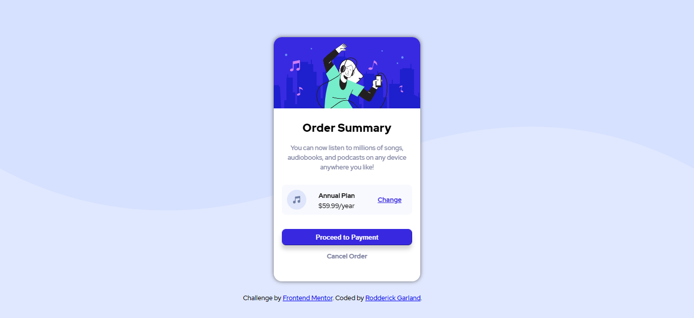

# Frontend Mentor - Order summary card solution

This is a solution to the [Order summary card challenge on Frontend Mentor](https://www.frontendmentor.io/challenges/order-summary-component-QlPmajDUj). Frontend Mentor challenges help you improve your coding skills by building realistic projects. 

## Table of contents

- [Overview](#overview)
  - [The challenge](#the-challenge)
  - [Screenshot](#screenshot)
  - [Links](#links)
- [My process](#my-process)
  - [Built with](#built-with)
  - [What I learned](#what-i-learned)
  - [Continued development](#continued-development)
  - [Useful resources](#useful-resources)
- [Author](#author)


## Overview

### The challenge

Users should be able to:

- See hover states for interactive elements

### Screenshot




### Links


- Live Site URL: [Vercel](https://order-summary-challenge.vercel.app/)

## My process

### Built with

- [React](https://reactjs.org/) - JS library
- Semantic UI - React
- CSS custom properties
- Flexbox


### What I learned

While coding this challenge, I learned workaround for button-hover states in React. React does not support the onHover attribute. 

```js
 function MouseOverPayment(event) {
        event.target.style.background = 'hsl(245, 82%,68%)';
    }
 function MouseOutPayment(event) {
        event.target.style.background = "hsl(245, 75%, 52%)";
    }
<button onMouseOver={MouseOverPayment} onMouseOut={MouseOutPayment} style={paymentButtonStyle}>Proceed to Payment</button>

```

### Continued development

I want to implement this challenge into a larger project and add some state

### Useful resources

- [Flexbox in 20 Minutes](https://www.youtube.com/watch?v=JJSoEo8JSnc&t=289s&ab_channel=TraversyMedia) - This helped me truly understand Flexbox. I really liked this video and will refer to it going forward.
- [11 Ways to Center Div or Text in Div in CSS](https://blog.hubspot.com/website/center-div-css) - A helpful resource in centering items on a page


## Author

- Frontend Mentor - [@zencoder24](https://www.frontendmentor.io/profile/zencoder24)


# Getting Started with Create React App

This project was bootstrapped with [Create React App](https://github.com/facebook/create-react-app).

## Available Scripts

In the project directory, you can run:

### `npm start`

Runs the app in the development mode.\
Open [http://localhost:3000](http://localhost:3000) to view it in the browser.

The page will reload if you make edits.\
You will also see any lint errors in the console.

### `npm test`

Launches the test runner in the interactive watch mode.\
See the section about [running tests](https://facebook.github.io/create-react-app/docs/running-tests) for more information.

### `npm run build`

Builds the app for production to the `build` folder.\
It correctly bundles React in production mode and optimizes the build for the best performance.

The build is minified and the filenames include the hashes.\
Your app is ready to be deployed!

See the section about [deployment](https://facebook.github.io/create-react-app/docs/deployment) for more information.

### `npm run eject`

**Note: this is a one-way operation. Once you `eject`, you can’t go back!**

If you aren’t satisfied with the build tool and configuration choices, you can `eject` at any time. This command will remove the single build dependency from your project.

Instead, it will copy all the configuration files and the transitive dependencies (webpack, Babel, ESLint, etc) right into your project so you have full control over them. All of the commands except `eject` will still work, but they will point to the copied scripts so you can tweak them. At this point you’re on your own.

You don’t have to ever use `eject`. The curated feature set is suitable for small and middle deployments, and you shouldn’t feel obligated to use this feature. However we understand that this tool wouldn’t be useful if you couldn’t customize it when you are ready for it.

